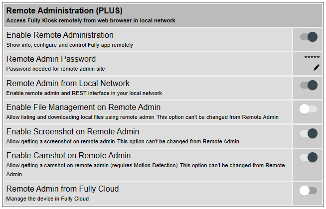
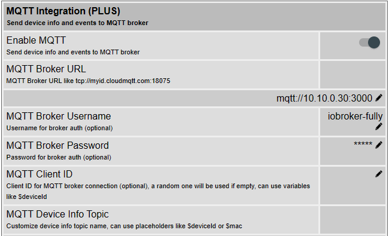

## Über diesen Adapter

Mit diesem Adapter kann der [Fully Kiosk Browser](https://www.fully-kiosk.com) (mit Plus-Lizenz) gesteuert werden. Über die [REST API](https://www.fully-kiosk.com/en/#rest) können diverse Befehle wie "Bildschirm an/aus", "Bildschirmschoner an/aus", etc. an den Fully gesendet werden.

Außerdem werden Events (wie z.B. "Bildschirm an") immer sofort via [MQTT](https://www.fully-kiosk.com/en/#mqtt) dem Adapter mitgeteilt und in den entsprechenden Datenpunkten angezeigt/gesetzt. Desweiteren sendet der Fully Browser via MQTT sämtliche Geräteinformationen immer automatisch mindestens alle 60 Sekunden, welche entsprechend in die Info-Datenpunkte geschrieben werden. Das Senden von Befehlen erfolgt übrigens über die REST API, da der Fully Browser das Senden über MQTT nicht unterstützt.

## Fully-Browser vorbereiten

### Remote Admin aktivieren
1. Auf dem Tablet die Fully Browser App öffnen und die Einstellungen (Settings) öffnen.
1. Menüpunkt **Remote Administration (PLUS)** aufrufen
1. **Enable Remote Administration** aktivieren
1. Bei **Remote Admin Password** ein Passwort vergeben
1. **Remote Admin from Local Network** aktivieren

### MQTT aktivieren
1. Auf dem Tablet die Fully Browser App öffnen und die Einstellungen (Settings) öffnen. Alternativ kannst du den Remote Admin auch von einem anderen Endgerät (z.B. PC) von einem Browser aus aufrufen, die Basis-URL ist hierbei immer http://ip-address:2323, nach dem Aufruf wirst du nach dem oben vergebenen Passwort gefragt.
2. Im Menü aufrufen: **Settings** -> **Other Settings** -> **MQTT Integration (PLUS)**
3. **Enable MQTT**: aktivieren
4. **MQTT Broker URL**: Im Format `mqtt://iobroker-ip-address:3000` eingeben. Dabei entspricht `iobroker-ip-address` der IP-Adresse vom ioBroker, und `3000` die Port-Nummer, die für die MQTT-Verbindung verwendet wird. 
5. **MQTT Broker Username**: hier kannst du optional einen Benutzernamen vergeben.
6. **MQTT Broker Password**: hier kannst du optional ein Passwort vergeben.
7. **MQTT Client ID**: kannst du leer lassen
8. **MQTT Device Info Topic**: hier kannst du die Voreinstellung so belassen, wird vom Adapter nicht weiter beachtet.
8. **MQTT Event Topic**: hier kannst du die Voreinstellung so belassen, wird vom Adapter nicht weiter beachtet.

## Adapter-Einstellungen

### Fully-Browser-Geräte
Fully-Browser-Gerät(e), also die Tablets, auf denen der Fully-Browser läuft, entsprechend hinzufügen, dabei:
1. **Gerätename**: Beliebiger Name des Tablets, wird gleichzeitig als Bestandteil der Objekte/Datenpunkte verwendet, z.B. aus `Tablet Flur` wird dann `fully-mqtt.0.Tablet-Flur`.
1. **Protokoll**: `http` so belassen. Falls `https` verwendet werden soll: siehe Hinweise unter [Remote Admin](https://www.fully-kiosk.com/en/#remoteadmin).
1. **Remote Admin Passwort**: das oben vergebene Passwort eintragen
1. **MQTT**: sollte aktiviert werden um alle Features des Adapters zu nutzen.

### MQTT-Konfiguration
 * **Port**: Dieselbe Portnummer wie oben in den Fullybrowser MQTT-Einstellungen verwenden (z.B. `3000`).

   
 * **Benutzername und Passwort nicht verifizieren**: Damit kann die Überprüfung von Benutzernamen und Passwort deaktiviert werden.
 * **Benutzername**: Optional
 * **Passwort**: Optional

### Experten-Einstellungen: MQTT
 * **Publizierte Infos nicht öfter als alle x Sekunden verarbeiten**: Lt. [Fully-Dokumentation](https://www.fully-kiosk.com/en/#mqtt) werden Infos nur alle 60 Sekunden publiziert, in meinen Tests erfolgte dies aber deutlich öfter, also kann hiermit ein Limit gesetzt werden.
 * **Info-Datenpunkte immer aktualisieren**: Normalerweise werden alle Info-Datenpunkte nur dann neu gesetzt, wenn es eine Änderung gab. Ist dies aktiviert, werden diese immer aktualisiert (mit ack:true), auch wenn es keine Änderung zum vorherigen Wert gab.
 * **Client- und Connection-Fehler als info im Log**: Wenn aktiviert, werden Client- und Verbindungsfehler immer als Info und nicht als Error im Log ausgegeben. Dies dient dazu, das Log sauber zu halten und nicht unnötig zu füllen, nur weil sich mal kurzzeitig ein Tablet abmeldet und nach wenigen Sekunden wieder anmeldet. Längerzeitige Fehler und Warnungen werden immer im Log entsprechend angezeigt.

### Experten-Einstellungen: Remote Admin (REST API)
 * **Request Timeout**: Nach Anzahl dieser Millisekunden wird ein REST API Request (also das Senden von Kommandos) abgebrochen, wenn nicht erfolgreich.

 ## Links

* [ioBroker-Forum: Adapter Fully Browser mit MQTT](https://forum.iobroker.net/topic/69729/)
* [fully-kiosk.com REST API](https://www.fully-kiosk.com/en/#rest)
* [fully-kiosk.com MQTT Integration](https://www.fully-kiosk.com/en/#mqtt)
